# Diagramas de Secuencia del Sistema (DSS) — ModaLink

> **Fase 2: Análisis (Proceso Unificado)**  
> **Fuente de Verdad de Datos**: [bd.sql](file:///C:/Users/HP/Desktop/modalink-backend/docs/0_nota_presentacion/bd.sql)  
> **Regla Metodológica**: El sistema es tratado como una caja negra unificada (`:Sistema`). Las operaciones tienen firmas exactas `nombreOperacion(params)` que se trasladan idénticas a los Contratos de Operación y a los DSD.

---

## 1. Módulo de Gestión de Usuarios (MOD-F-01)

### DSS-01 | Iniciar Sesión (UC-01)
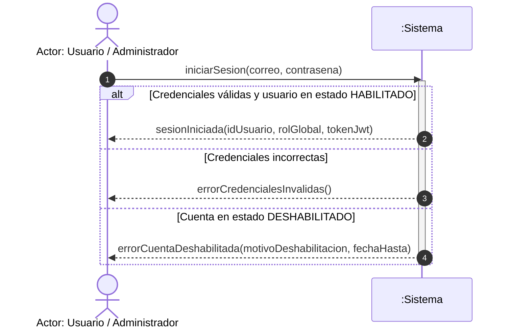

---

### DSS-03 | Registrarse en el Sistema (UC-03)
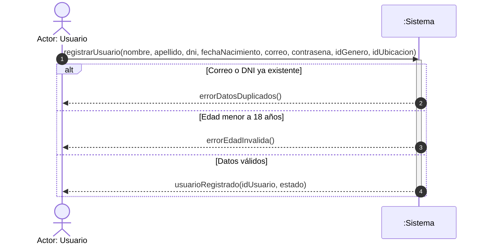

---

### DSS-04 | Deshabilitar Usuario (UC-04)
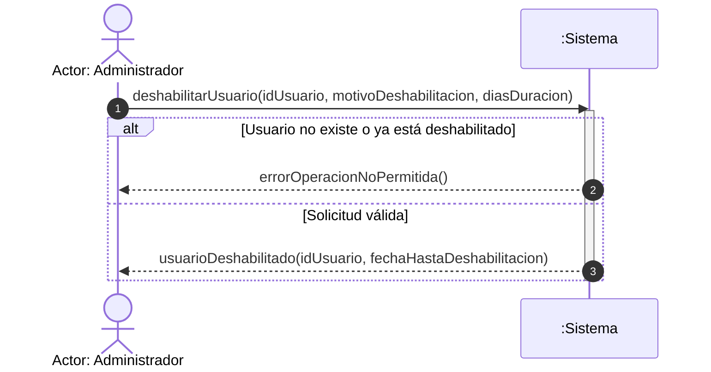

---

### DSS-07 | Solicitar Baja en el Sistema (UC-07)
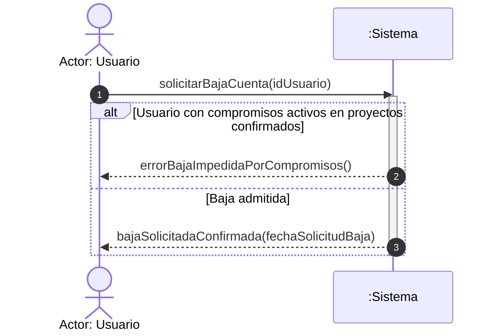

---

## 2. Módulo de Gestión de Perfiles (MOD-F-02)

### DSS-10 | Crear Perfil Creativo (UC-10)
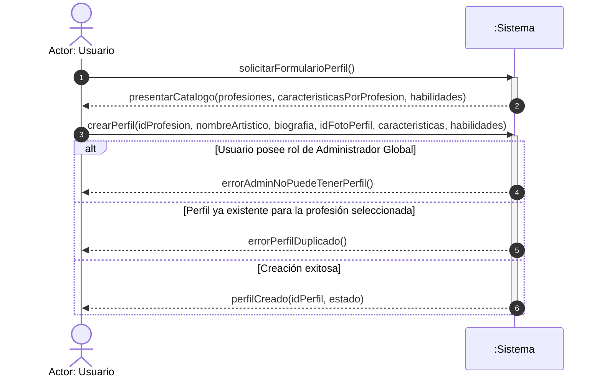

---

### DSS-11 | Editar Perfil (UC-11)
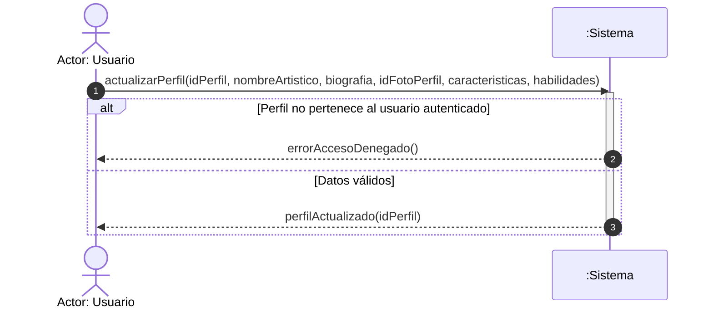

---

### DSS-12 | Eliminar Perfil (Borrado Lógico) (UC-12)
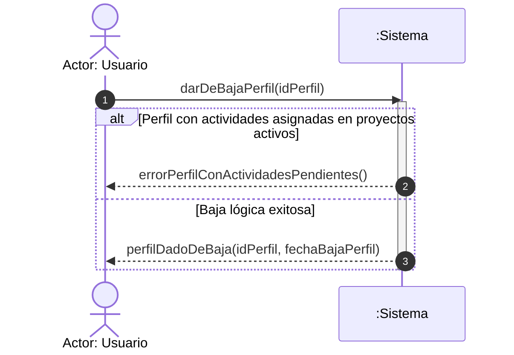

---

## 3. Módulo de Gestión de Disponibilidad (MOD-F-05)

### DSS-17/18 | Asignar Bloqueo de Agenda / Modificar Jornada (UC-17, UC-18)
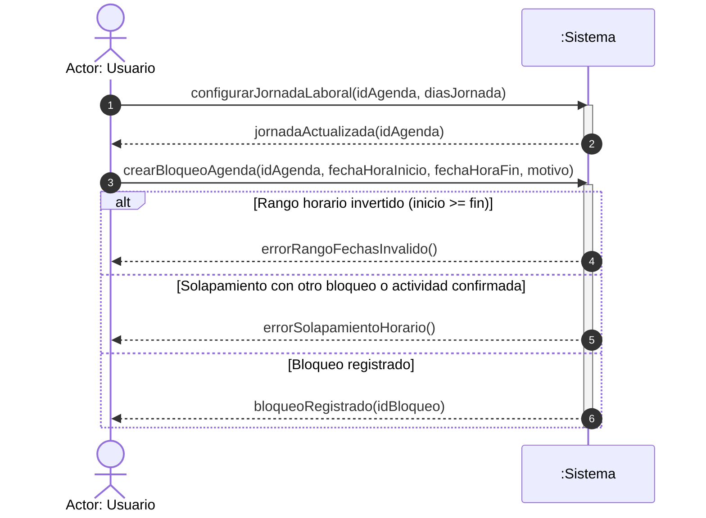

---

## 4. Módulo de Gestión de Proyectos y Planificación (MOD-F-06, MOD-F-07)

### DSS-24 | Crear Proyecto (UC-24)
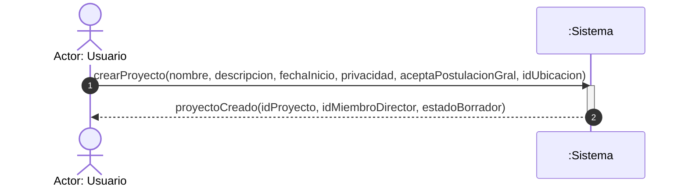

---

### DSS-49 | Crear Actividad en Planificación (UC-49)
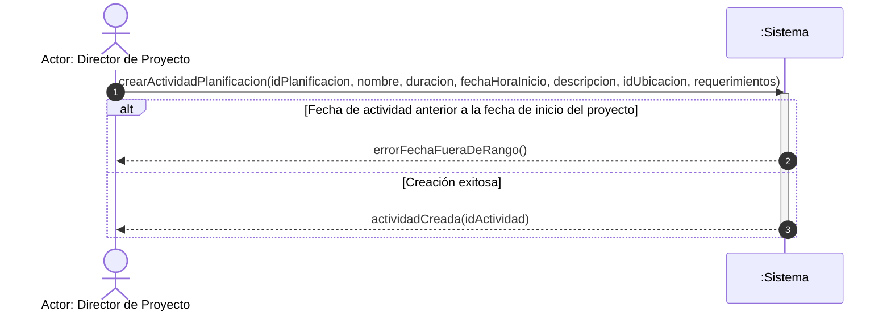

---

### DSS-60 | Confirmar Proyecto (UC-60)
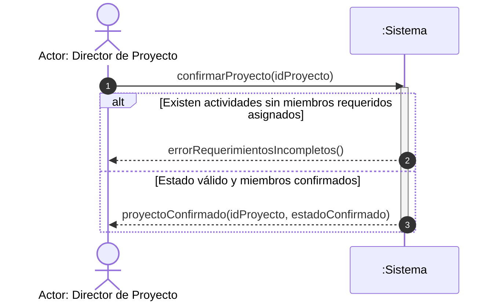

---

## 5. Módulo de Publicaciones e Interacción (MOD-F-03, MOD-F-04)

### DSS-19 | Alta de Publicación con Detección de Coautoría (UC-19)
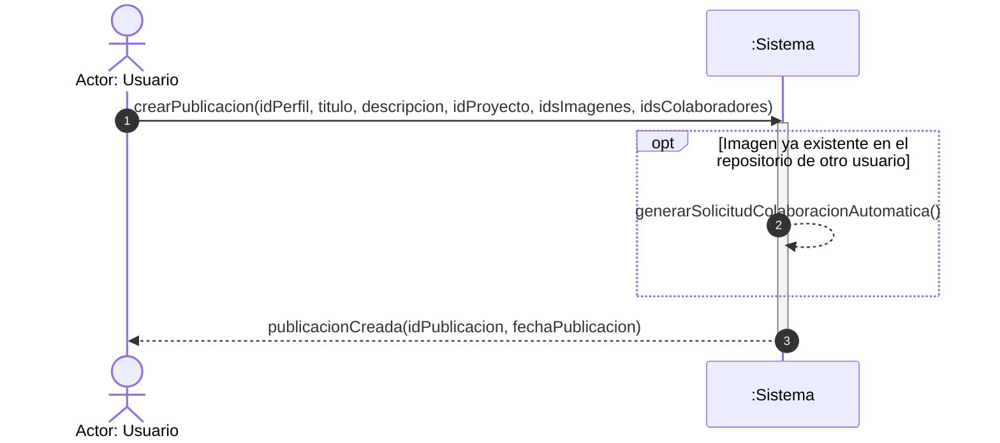
