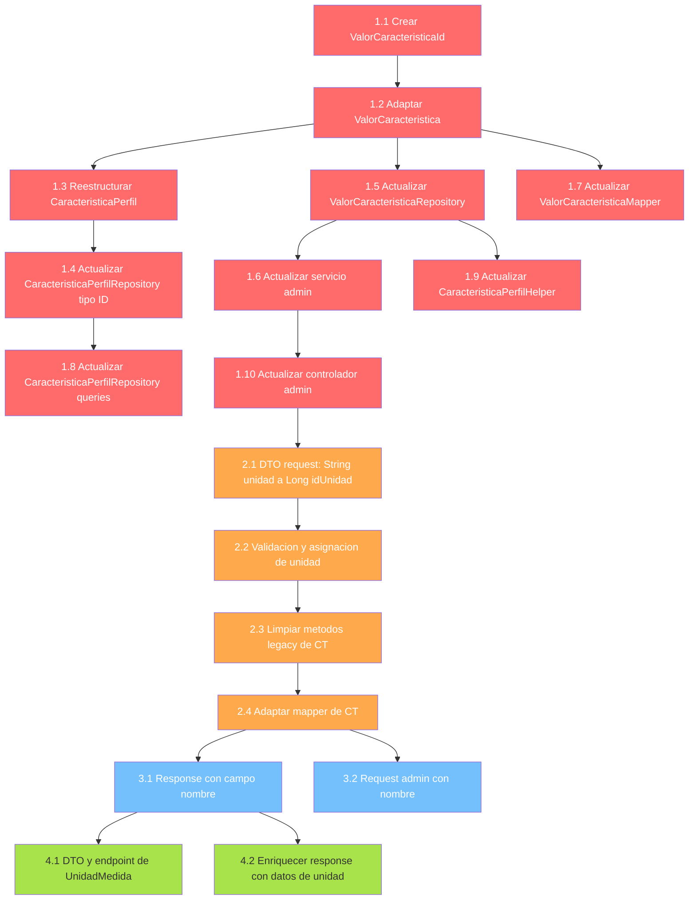

# Plan de Acción — Adaptación del Módulo de Características Técnicas

**Fecha:** 2026-09-28  
**Basado en:** `auditoria_modulo_caracteristicas_tecnicas.md` (revisión 3)  
**Fuente de verdad:** `docs/3_diseño/ModaLinkBD.sql`  
**Estado:** ⏸️ Pendiente de aprobación

---

## Principios del plan

1. **Orden por dependencia**: La PK compuesta de `ValorCaracteristica` (H-02) es la raíz de la mayoría de los cambios. Se corrige primero, y el resto se adapta en cascada.
2. **Compilabilidad continua**: Cada fase debe dejar el proyecto compilable. No se puede corregir H-02 sin corregir H-13/H-14 simultáneamente.
3. **Sin cambios de comportamiento externo en Fase 1**: Los endpoints mantienen su contrato actual; solo se corrige el mapeo JPA internamente.
4. **Cambios de contrato API en Fase 2**: Se adaptan DTOs y validaciones.

---

## Fase 1 — Críticos (H-02, H-03, H-13, H-14, H-20)

> Todos deben aplicarse en un solo commit para mantener compilabilidad.

### Tarea 1.1: Crear `ValorCaracteristicaId` (H-02)

**Archivo:** `src/main/java/org/mgroko/backend/modelo/ValorCaracteristicaId.java` **(CREAR)**

| Aspecto | Detalle |
|---------|---------|
| Clase | `@Embeddable`, implementa `Serializable` |
| Campos | `Long idValor` (`@Column(name = "id_valor")`), `Long idCaracteristica` (`@Column(name = "id_caracteristica")`) |
| Métodos | `equals()`, `hashCode()`, constructor vacío + completo |
| Patrón | Seguir el mismo patrón que usaba `CaracteristicaPerfilId` (equals/hashCode sobre ambos campos) |

### Tarea 1.2: Adaptar `ValorCaracteristica` a PK compuesta (H-02)

**Archivo:** `src/main/java/org/mgroko/backend/modelo/ValorCaracteristica.java`

| Cambio | Antes | Después |
|--------|-------|---------|
| Anotación de ID | `@Id @GeneratedValue` sobre `idValor` | `@EmbeddedId private ValorCaracteristicaId id` |
| Relación a CT | `@ManyToOne @JoinColumn(name="id_caracteristica")` | `@ManyToOne @MapsId("idCaracteristica") @JoinColumn(name="id_caracteristica")` |
| Acceso a idValor | `getIdValor()` directo | Accessor de conveniencia `getIdValor() { return id != null ? id.getIdValor() : null; }` |
| Métodos legacy | `getCodigo()/setCodigo()` que delegan a `etiqueta` | Eliminar — usar `etiqueta` directamente |
| Builder custom | `ValorCaracteristicaBuilder.codigo()` | Eliminar — adaptar a `etiqueta` |

### Tarea 1.3: Reestructurar `CaracteristicaPerfil` — PK simple + FK compuesta (H-20, H-03)

**Archivos:**
- `src/main/java/org/mgroko/backend/modelo/CaracteristicaPerfil.java` — restructurar
- `src/main/java/org/mgroko/backend/modelo/CaracteristicaPerfilId.java` — **ELIMINAR**

**Contexto:** La BD define `id_caracteristica_perfil` (IDENTITY) como PK simple. El código actual usa `@EmbeddedId CaracteristicaPerfilId(idPerfil, idCaracteristica)`, que no corresponde. El par `(id_perfil, id_caracteristica)` es solo un UNIQUE INDEX.

| Cambio | Antes | Después |
|--------|-------|---------|
| PK | `@EmbeddedId CaracteristicaPerfilId` | `@Id @GeneratedValue(strategy = IDENTITY) @Column(name = "id_caracteristica_perfil") Long idCaracteristicaPerfil` |
| Relación a Perfil | `@MapsId("idPerfil") @JoinColumn(name = "id_perfil")` | `@ManyToOne @JoinColumn(name = "id_perfil", nullable = false)` (FK simple, sin `@MapsId`) |
| Relación a CT | `@MapsId("idCaracteristica") @JoinColumn(name = "id_caracteristica")` | `@ManyToOne @JoinColumn(name = "id_caracteristica", nullable = false)` (FK simple, sin `@MapsId`) |
| FK a ValorCaracteristica | `@JoinColumn(name = "id_valor")` | `@JoinColumns({@JoinColumn(name="id_valor", referencedColumnName="id_valor"), @JoinColumn(name="id_caracteristica", referencedColumnName="id_caracteristica", insertable=false, updatable=false)})` |
| Unicidad | Implícita por `@EmbeddedId` | `@Table(uniqueConstraints = @UniqueConstraint(columnNames = {"id_perfil", "id_caracteristica"}))` |
| `CaracteristicaPerfilId.java` | Existe | **ELIMINAR** — ya no se necesita |

> `insertable=false, updatable=false` en `id_caracteristica` del `@JoinColumns` porque la columna ya está mapeada por la relación `@ManyToOne caracteristicaTecnica`.

### Tarea 1.4: Actualizar `CaracteristicaPerfilRepository` (H-20)

**Archivo:** `src/main/java/org/mgroko/backend/repositorio/CaracteristicaPerfilRepository.java`

| Cambio | Antes | Después |
|--------|-------|---------|
| Tipo de ID | `JpaRepository<CaracteristicaPerfil, CaracteristicaPerfilId>` | `JpaRepository<CaracteristicaPerfil, Long>` |
| Import | `import CaracteristicaPerfilId` | Eliminar |

### Tarea 1.5: Actualizar `ValorCaracteristicaRepository` (H-13)

**Archivo:** `src/main/java/org/mgroko/backend/repositorio/ValorCaracteristicaRepository.java`

| Cambio | Antes | Después |
|--------|-------|---------|
| Tipo de ID | `JpaRepository<ValorCaracteristica, Long>` | `JpaRepository<ValorCaracteristica, ValorCaracteristicaId>` |
| `findByCaracteristicaTecnicaIdCaracteristicaOrderByCodigo` | Navegación por `codigo` (alias de etiqueta) | Adaptar a `findByCaracteristicaTecnica_IdCaracteristicaOrderByEtiqueta` o usar `@Query` |
| `existsByCaracteristicaTecnicaIdCaracteristicaAndCodigo` | Usa `codigo` | Adaptar a `existsByCaracteristicaTecnica_IdCaracteristicaAndEtiqueta` o usar `@Query` |

### Tarea 1.6: Actualizar servicio admin — búsquedas por PK compuesta (H-14)

**Archivo:** `src/main/java/org/mgroko/backend/admin/servicio/AdminCaracteristicaTecnicaService.java`

| Método | Cambio |
|--------|--------|
| `actualizarValor(Long idValor, ...)` | Cambiar firma a `actualizarValor(Long idCaracteristica, Long idValor, ...)`. Construir `ValorCaracteristicaId` para `findById()`. |
| `eliminarValor(Long idValor)` | Cambiar firma a `eliminarValor(Long idCaracteristica, Long idValor)`. Construir `ValorCaracteristicaId` para `findById()`. |
| `agregarValor(...)` L161 | Al construir `ValorCaracteristica`, setear `id = new ValorCaracteristicaId(null, idCaracteristica)` (IDENTITY genera `idValor`). |
| `agregarValoresIniciales(...)` L210 | Mismo ajuste que `agregarValor`. |
| Refs a `getCodigo()/setCodigo()` | Reemplazar por `getEtiqueta()/setEtiqueta()` |

### Tarea 1.7: Actualizar mapper de `ValorCaracteristica` (H-17)

**Archivo:** `src/main/java/org/mgroko/backend/perfiles/mapper/ValorCaracteristicaMapper.java`

| Cambio | Antes | Después |
|--------|-------|---------|
| Acceso a ID | `valor.getIdValor()` | `valor.getId().getIdValor()` o accessor de conveniencia |
| Acceso a código | `valor.getCodigo()` | `valor.getEtiqueta()` |

### Tarea 1.8: Actualizar `CaracteristicaPerfilRepository` — queries derivadas (H-15)

**Archivo:** `src/main/java/org/mgroko/backend/repositorio/CaracteristicaPerfilRepository.java`

| Cambio | Antes | Después |
|--------|-------|---------|
| `existsByValorCaracteristicaIdValor(Long)` | Navegación simple | `existsByValorCaracteristica_Id_IdValor(Long)` o `@Query` explícita |

### Tarea 1.9: Actualizar `CaracteristicaPerfilHelper` (H-16)

**Archivo:** `src/main/java/org/mgroko/backend/perfiles/servicio/CaracteristicaPerfilHelper.java`

| Cambio | Antes | Después |
|--------|-------|---------|
| L71: `new CaracteristicaPerfilId(null, ...)` | Construye `@EmbeddedId` | Eliminar — ya no se necesita, la PK es autogenerada |
| L82: `findById(car.idValor())` | `Long` simple | Construir `ValorCaracteristicaId(car.idValor(), car.idCaracteristica())` |

### Tarea 1.10: Actualizar controlador admin (rutas de valores)

**Archivo:** `src/main/java/org/mgroko/backend/admin/controlador/AdminCaracteristicaTecnicaController.java`

| Cambio | Detalle |
|--------|---------|
| Rutas de `actualizarValor` y `eliminarValor` | Deben recibir `idCaracteristica` + `idValor` como path variables (ej: `/caracteristicas/{idCaracteristica}/valores/{idValor}`) |

**Criterio de aceptación Fase 1:** El proyecto compila, los tests unitarios existentes pasan (con ajustes mínimos), `CaracteristicaPerfil` usa PK simple IDENTITY, `ValorCaracteristica` usa PK compuesta, y las operaciones CRUD de valores usan la PK compuesta correctamente.

---

## Fase 2 — Altos (H-04, H-05, H-06)

### Tarea 2.1: Adaptar DTO request admin a `Long idUnidad` (H-04)

**Archivo:** `src/main/java/org/mgroko/backend/admin/dto/AdminCaracteristicaTecnicaRequest.java`

| Cambio | Antes | Después |
|--------|-------|---------|
| Campo unidad | `@Size(max = 50) String unidad` | `Long idUnidad` (nulleable — las ENUMERADO no requieren unidad) |

### Tarea 2.2: Corregir servicio admin — validación y asignación de unidad (H-05, H-06)

**Archivo:** `src/main/java/org/mgroko/backend/admin/servicio/AdminCaracteristicaTecnicaService.java`

| Paso | Detalle |
|------|---------|
| Inyectar | `UnidadMedidaRepository` en el constructor |
| En `crear()` | Si `idUnidad != null`: buscar `UnidadMedida` con `findById()`, validar existencia, validar que `tipoDatoPermitido` coincida con `tipoDato`, setear `caracteristica.setUnidadMedida(unidad)` |
| En `actualizar()` | Misma lógica que en `crear()` |
| Eliminar | Llamadas a `setUnidad(String)` y uso del builder `.unidad(String)` |

### Tarea 2.3: Limpiar métodos legacy de `CaracteristicaTecnica` (H-08, H-09)

**Archivo:** `src/main/java/org/mgroko/backend/modelo/CaracteristicaTecnica.java`

| Eliminar | Motivo |
|----------|--------|
| `getUnidad()` / `setUnidad(String)` (L44-58) | Creaban `UnidadMedida` transient. Reemplazar por `getUnidadMedida()/setUnidadMedida()` que Lombok ya genera |
| Builder customizado con `unidadTemp` (L60-83) | Mismo problema. El builder de Lombok estándar con `unidadMedida(UnidadMedida)` es suficiente |

> **Impacto cascada**: `CaracteristicaTecnicaMapper.toResponse()` llama a `getUnidad()` → adaptar (ver Tarea 2.4).

### Tarea 2.4: Adaptar mapper de `CaracteristicaTecnica` (H-19)

**Archivo:** `src/main/java/org/mgroko/backend/perfiles/mapper/CaracteristicaTecnicaMapper.java`

| Cambio | Antes | Después |
|--------|-------|---------|
| `caracteristica.getUnidad()` | Devuelve String (símbolo) | Acceder a `getUnidadMedida()` y extraer símbolo si no null |

**Criterio de aceptación Fase 2:** El endpoint admin de crear/actualizar CT recibe `idUnidad` (Long), valida existencia y compatibilidad de tipo, y persiste la relación correctamente.

---

## Fase 3 — Medios (refinamiento)

### Tarea 3.1: Adaptar `CaracteristicaTecnicaResponse` con campo `nombre` (H-11)

**Archivos:**
- `src/main/java/org/mgroko/backend/perfiles/dto/CaracteristicaTecnicaResponse.java` — agregar `String nombre`
- `src/main/java/org/mgroko/backend/perfiles/mapper/CaracteristicaTecnicaMapper.java` — mapear `nombre`

### Tarea 3.2: Agregar `String nombre` al request admin (H-18)

**Archivos:**
- `src/main/java/org/mgroko/backend/admin/dto/AdminCaracteristicaTecnicaRequest.java` — agregar `@Size(max = 100) String nombre`
- `src/main/java/org/mgroko/backend/admin/servicio/AdminCaracteristicaTecnicaService.java` — setear `nombre` en `crear()` y `actualizar()`

---

## Fase 4 — Bajos (endpoints y DTOs adicionales)

### Tarea 4.1: Crear DTO y endpoint para `UnidadMedida` (H-12)

**Archivos a crear:**
- `src/main/java/org/mgroko/backend/admin/dto/UnidadMedidaResponse.java` — record con `Long idUnidad, String nombre, String simbolo, String tipoDatoPermitido`
- Endpoint en controller admin o general para `GET /unidades-medida` (listar todas) y `GET /unidades-medida?tipoDato=NUMERICO` (filtrar por tipo compatible)

### Tarea 4.2: Enriquecer response de CT con datos de unidad (H-19)

**Archivos:**
- `CaracteristicaTecnicaResponse` — cambiar `String unidad` por un objeto `UnidadMedidaResponse` embebido (o agregar campos `idUnidad`, `simboloUnidad`, `nombreUnidad`)
- `CaracteristicaTecnicaMapper` — mapear datos completos de la unidad

---

## Resumen de archivos por fase

| Fase | Archivos a modificar | Archivos a crear | Archivos a eliminar |
|------|---------------------|-----------------|--------------------|
| **1** | `ValorCaracteristica.java`, `CaracteristicaPerfil.java`, `ValorCaracteristicaRepository.java`, `CaracteristicaPerfilRepository.java`, `AdminCaracteristicaTecnicaService.java`, `ValorCaracteristicaMapper.java`, `CaracteristicaPerfilHelper.java`, `AdminCaracteristicaTecnicaController.java` | `ValorCaracteristicaId.java` | `CaracteristicaPerfilId.java` |
| **2** | `AdminCaracteristicaTecnicaRequest.java`, `AdminCaracteristicaTecnicaService.java`, `CaracteristicaTecnica.java`, `CaracteristicaTecnicaMapper.java` | — | — |
| **3** | `CaracteristicaTecnicaResponse.java`, `CaracteristicaTecnicaMapper.java`, `AdminCaracteristicaTecnicaRequest.java`, `AdminCaracteristicaTecnicaService.java` | — | — |
| **4** | `CaracteristicaTecnicaResponse.java`, `CaracteristicaTecnicaMapper.java` | `UnidadMedidaResponse.java` | — |

---

## Diagrama de dependencia de tareas

**Leyenda:** 🔴 Fase 1 (Críticos) → 🟠 Fase 2 (Altos) → 🔵 Fase 3 (Medios) → 🟢 Fase 4 (Bajos)

