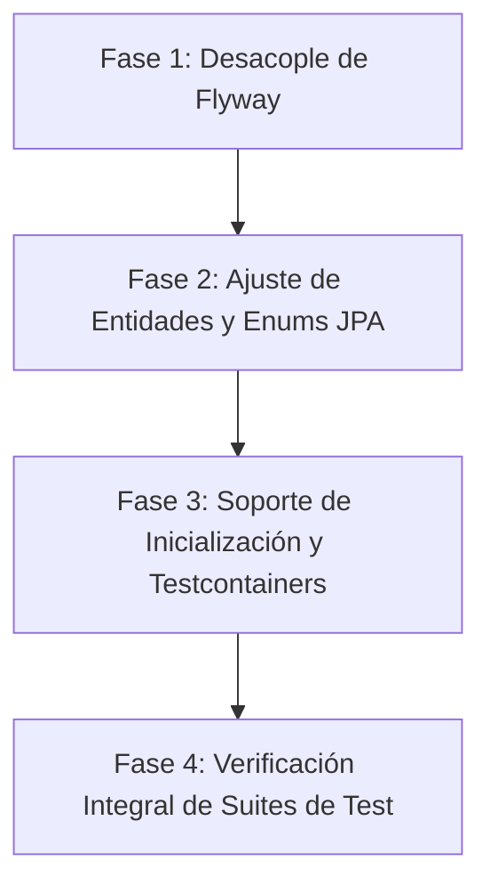

# Estado del Sistema — Versión 0.4

> **Fase 5: Estado del Sistema (Proceso Unificado)**  
> **Fecha de Corte**: 26 de Septiembre de 2026  
> **Versión**: v0.4  
> **Fuente de Verdad de BD**: Modelo CASE — `docs/3_diseño/ModaLinkBD.sql` (Reemplazo integral de Flyway)

---

## 1. Resumen Ejecutivo de la Versión

La versión **v0.4** marca un cambio de paradigma en la administración del modelo de persistencia del proyecto **ModaLink**:
- **Desacoplamiento total de Flyway**: Se elimina la gestión incremental mediante migraciones numeradas (`V1..V23`). El ciclo de vida DDL, constraints, triggers y semillas base pasa a ser gestionado de forma externa mediante una herramienta **CASE (ER/Studio Data Architect)**, cuya salida unificada es el script maestro [`docs/3_diseño/ModaLinkBD.sql`](file:///c:/Users/HP/Desktop/modalink-backend/docs/3_dise%C3%B1o/ModaLinkBD.sql).
- **Consistencia y Auditoría Integral**: Se incorpora a nivel base de datos una infraestructura automatizada de auditoría relacional (`auditoria`, `detalle_auditoria`, `tipo_accion_auditoria`) gobernada por triggers PL/pgSQL ante mutaciones críticas en usuarios y proyectos.
- **Armonización de Convenciones**: El nuevo script CASE introduce convenciones estándar de PostgreSQL (identificadores en minúsculas, triggers con nombre unificado, columnas calculadas e índices compuestos) y formaliza la capitalización de valores en tablas y constraints (`CHECK` en mayúsculas `UPPERCASE`: ej. `'ACTIVO'`, `'BORRADOR'`, `'PENDIENTE'`, etc.).
- **Diagnóstico y Hoja de Ruta**: El presente documento expone el análisis comparativo exhaustivo entre el script SQL CASE generado y la documentación formal del sistema ([`casos_de_uso.md`](file:///c:/Users/HP/Desktop/modalink-backend/docs/1_requisitos/casos_de_uso.md), [`contratos.md`](file:///c:/Users/HP/Desktop/modalink-backend/docs/2_analisis/contratos.md) y [`dss.md`](file:///c:/Users/HP/Desktop/modalink-backend/docs/2_analisis/dss.md)), estableciendo el plan de acción para adaptar las entidades JPA, configuraciones de Spring Boot y suites de prueba.

---

## 2. Análisis Exhaustivo del Script SQL CASE (`ModaLinkBD.sql`)

El script [`ModaLinkBD.sql`](file:///c:/Users/HP/Desktop/modalink-backend/docs/3_dise%C3%B1o/ModaLinkBD.sql) consta de **2724 líneas**, estructurado en:
1. Definición de 31 tablas con tipos `int8` (bigint con `GENERATED BY DEFAULT AS IDENTITY`), `varchar`, `numeric`, `timestamp` y `time`.
2. Triggers de negocio y de integridad referencial dura implementados directamente en PostgreSQL (PL/pgSQL).
3. Claves foráneas e índices únicos compuestos (`UNIQUE INDEX`).
4. Carga inicial de datos maestros (**Seeds**) con cláusulas `ON CONFLICT (...) DO UPDATE / DO NOTHING` y sincronización de secuencias (`setval`).

### 2.1. Tablas y Entidades Relevadas

| Tabla | PK / Identificador | Constraints Clave & Triggers Asociados |
| :--- | :--- | :--- |
| `usuario` | `id_usuario` (`int8`) | CHECK estado (`ACTIVO`, `DESHABILITADO`, `PENDIENTE_BAJA`, `BAJA`), proveedor auth (`LOCAL`, `GOOGLE`), edad $\ge 18$ años, formato correo. Triggers: `chk_usuario_dni_no_negativo`, `fn_crear_agenda`, `fn_auditar_cambio_usuario`. |
| `perfil` | `id_perfil` (`int8`) | CHECK estado (`ACTIVO`, `DESHABILITADO`, `PENDIENTE_BAJA`, `BAJA`). Triggers: `chk_perfil_unico_por_profesion`, `chk_perfil_no_cambiar_profesion`, `chk_perfil_fecha_solicitud_baja`. |
| `agenda` | `id_agenda` (`int8`) | FK `id_usuario`, `margen_actividad_min` (default 30, $\ge 0$). Creada automáticamente por trigger de `usuario`. |
| `jornada_agenda` | `id_jornada` (`int8`) | FK `id_agenda`, `dia_semana` (1 a 7), `hora_inicio_manana`, `hora_fin_manana`, `hora_inicio_tarde`, `hora_fin_tarde`. Creada por defecto para L-V (09:00 a 18:00). |
| `bloqueo_agenda` | `id_bloqueo` (`int8`) | FK `id_agenda`. Triggers: `trg_bloqueo_no_solape` (evita solapamiento manual) y `trg_bloqueo_no_liberar_actividad` (impide borrar bloqueo si solapa con actividad de proyecto confirmado/publicado). |
| `proyecto` | `id_proyecto` (`int8`) | CHECK estado (`BORRADOR`, `PUBLICADO`, `CONFIRMADO`, `FINALIZADO`, `CANCELADO`), privacidad (`PUBLICO`, `PRIVADO`, `OCULTO`). Constraint trigger diferido: `trg_proyecto_requiere_director` (exige al menos un director activo al commit). Trigger: `trg_auditar_cambio_proyecto`. |
| `planificacion` | `id_planificacion` (`int8`) | FK `id_proyecto` (1:1). Trigger: `trg_validar_planificacion_fecha_coherente` (`fecha_entrega >= fecha_inicio` del proyecto). |
| `actividad` | `id_actividad` (`int8`) | CHECK estado (`PENDIENTE`, `EN_CURSO`, `FINALIZADA`, `CANCELADA`), `duracion_minutos > 0`. Trigger: `trg_derivar_cumplimiento_hito` (si pasa a `FINALIZADA`, evalúa si cumple hitos y genera notificaciones al director). |
| `dependencia_actividades` | `(id_actividad_sucesora, id_actividad_predecesora)` | Tabla asociativa de precedencia de actividades de la planificación (grafo CPM). |
| `miembros_proyecto` | `id_miembro` (`int8`) | FKs `id_proyecto`, `id_perfil`, `id_rol_proyecto`, `id_tyc_aceptado`. CHECK `estado_participacion` (`ACTIVO`, `BAJA_VOLUNTARIA`, `ELIMINADO`). Trigger: `trg_validar_minimo_un_director_miembro`. Columna con comillas `"motivoBaja"`. |
| `asignacion_actividad` | `id_asignacion_act` (`int8`) | FK `id_miembro`, `id_actividad`. UQ `(id_miembro, id_actividad)`. Trigger: `trg_notificar_asignacion_actividad`. |
| `requerimiento_actividad` | `id_requerimiento_act` (`int8`) | FKs `id_actividad`, `id_profesion`. Cantidad $>0$. Vinculado a `requerimiento_act_habilidad` y `requerimiento_act_caract`. |
| `requerimiento_gral_proyecto` | `id_requerimiento_gral` (`int8`) | FKs `id_proyecto`, `id_profesion`. Cantidad $>0$. Vinculado a `requerimiento_gral_habilidad` y `requerimiento_gral_caract`. |
| `postulacion_actividad` | `id_postulacion` (`int8`) | CHECK estado (`PENDIENTE`, `RECHAZADA`, `ACEPTADA`). Trigger: `trg_control_cupo_postulacion_actividad` (al aceptar y llenar cupo, rechaza pendientes). |
| `postulacion_gral` | `id_postulacion_gral` (`int8`) | CHECK estado (`PENDIENTE`, `RECHAZADA`, `ACEPTADA`). Trigger: `trg_control_cupo_postulacion_gral`. |
| `invitacion_actividad` | `id_invitacion` (`int8`) | CHECK estado (`PENDIENTE`, `RECHAZADA`, `ACEPTADA`). Remitente, destinatario y requerimiento de actividad. |
| `invitacion_gral` | `id_invitacion_gral` (`int8`) | CHECK estado (`PENDIENTE`, `RECHAZADA`, `ACEPTADA`). Remitente, destinatario y requerimiento general. |
| `hito` y `hito_actividad` | `id_hito` (`int8`), `(id_hito, id_actividad)` | Triggers: `trg_validar_fecha_limite_hito` ($\le$ fecha entrega planificación) y `trg_validar_borrado_hito` (impide borrar si tiene actividades). |
| `notificacion` | `id_notificacion` (`int8`) | Tabla desacoplada de avisos generados por el sistema y triggers. |
| `auditoria` y `detalle_auditoria` | `id_auditoria`, `id_detalle_auditoria` | Registro de trazabilidad y mutaciones de estado/roles de usuarios y proyectos. |
| `publicacion`, `imagen_*`, `comentario`, `me_gusta`, `solicitud_colaboracion` | Tablas de interacción | Tablas correspondientes al módulo de portfolio y colaboraciones sociales. |
| Catálogos base | PKs `int8` | `pais`, `provincia`, `ciudad`, `ubicacion`, `profesion`, `habilidad`, `genero`, `rol_global`, `rol_proyecto`, `permiso_global`, `permiso_proyecto`, `unidad_medida`, `caracteristica_tecnica`, `valor_caracteristica`, `tipo_accion_auditoria`, `configuracion_sistema`, `perfil_tyc`. |

---

## 3. Contrastación: Base de Datos CASE vs. Casos de Uso, Contratos y DSS

A partir de la inspección cruzada entre [`ModaLinkBD.sql`](file:///c:/Users/HP/Desktop/modalink-backend/docs/3_dise%C3%B1o/ModaLinkBD.sql), [`casos_de_uso.md`](file:///c:/Users/HP/Desktop/modalink-backend/docs/1_requisitos/casos_de_uso.md), [`contratos.md`](file:///c:/Users/HP/Desktop/modalink-backend/docs/2_analisis/contratos.md) y [`dss.md`](file:///c:/Users/HP/Desktop/modalink-backend/docs/2_analisis/dss.md), se identifican las siguientes correlaciones y puntos de atención:

### 3.1. Hallazgos y Concordancias Positivas
1. **Reglas de Integridad trasladas al Motor de BD:**
   - La regla descrita en los contratos de creación y asignación (`crearProyecto`, `modificarActividad`, `publicarProyecto`) respecto a que **debe existir un director de proyecto activo** está resuelta mediante el constraint trigger `trg_proyecto_requiere_director` y `trg_validar_minimo_un_director_miembro`.
   - El control de cupos al aceptar una postulación (`UC-34 / aceptarPostulacion`) se encuentra automatizado a nivel de base de datos con `fn_control_cupo_postulacion_actividad` y `fn_control_cupo_postulacion_gral`, cerrando automáticamente las demás postulaciones cuando se alcanza la cantidad requerida.
   - El cumplimiento de hitos por cierre de actividades (`UC-50 / UC-51`) dispara notificaciones automáticas y actualización de estado `CUMPLIDO` mediante `fn_derivar_cumplimiento_hito`.
2. **Protección de Agenda y Disponibilidad:**
   - `fn_validar_solape_bloqueo` garantiza la consistencia física de la agenda en `UC-18: Asignar día no disponible`.
   - `fn_validar_bloqueo_no_actividad` refuerza que un usuario no pueda desmarcar o borrar un bloqueo (`UC-17`) si dicho horario ya fue comprometido por una actividad de proyecto confirmado/publicado.
3. **Población Completa de Semillas (Seeds):**
   - El script CASE incluye la totalidad de habilidades (`10`), profesiones (`7`), roles y permisos globales/de proyecto, configuración del sistema, unidades de medida y valores de características de modelos. Además, ejecuta `setval(...)` sobre todas las secuencias para evitar colisiones de IDs al insertar nuevas filas desde la aplicación.

### 3.2. Divergencias y Puntos Críticos a Resolver en el Backend

1. **Valores de Enums (Case-Sensitivity en Constraints SQL):**
   - En el backend actual, varios enums JPA están mapeados en estilo PascalCase o minúscula:
     - `EstadoUsuario`: `Activo`, `Deshabilitado`, `PendienteBaja`, `Baja`. Sin embargo, `ModaLinkBD.sql` exige:
       `CHECK (estado IN ('ACTIVO', 'DESHABILITADO', 'PENDIENTE_BAJA', 'BAJA'))`.
     - `EstadoPerfil`: `Activo`, `PendienteBaja`, `Baja`. El script exige:
       `CHECK (estado IN ('ACTIVO', 'DESHABILITADO', 'PENDIENTE_BAJA', 'BAJA'))`.
     - `EstadoProyecto`: `Borrador`, `Publicado`, `Confirmado`, `Finalizado`, `Cancelado`. El script exige:
       `CHECK (estado IN ('BORRADOR', 'PUBLICADO', 'CONFIRMADO', 'FINALIZADO', 'CANCELADO'))`.
     - `Privacidad`: `Publico`, `Privado`, `Oculto`. El script exige:
       `CHECK (privacidad IN ('PUBLICO', 'PRIVADO', 'OCULTO'))`.
     - `EstadoSolicitud`: `Pendiente`, `Aceptada`, `Rechazada`. El script exige:
       `CHECK (estado IN ('PENDIENTE', 'RECHAZADA', 'ACEPTADA'))`.
     - `EstadoParticipacion`: `Activo`, `BajaVoluntaria`, `Eliminado`. El script exige:
       `CHECK (estado_participacion IN ('ACTIVO', 'BAJA_VOLUNTARIA', 'ELIMINADO'))`.
     - *Impacto*: Si Spring Boot persiste entidades con valores como `"Activo"`, la base de datos lanzará inmediatamente una violación de restricción `CHECK`.
2. **Discrepancia en Nombres de Columnas:**
   - En `agenda`: la entidad JPA mapea `margen_actividad_minutos`, mientras que el SQL CASE define la columna como `margen_actividad_min`.
   - En `jornada_agenda`: la entidad JPA mapea `horario_inicio_maniana`, `horario_fin_maniana`, `horario_inicio_tarde`, `horario_fin_tarde`. El SQL CASE define `hora_inicio_manana`, `hora_fin_manana`, `hora_inicio_tarde`, `hora_fin_tarde`.
   - En `miembros_proyecto`: el SQL CASE define `"motivoBaja"` (con comillas y camelCase forzado) y FK `id_tyc_aceptado int8 NOT NULL`. La entidad JPA actual no mapea `id_tyc_aceptado` ni `"motivoBaja"`.
   - En `requerimiento_actividad`: el PK en el SQL CASE es `id_requerimiento_act`, mientras que la entidad JPA tiene `@Column(name = "id_requerimiento")`.
   - En `actividad`: la entidad JPA carece del mapeo del campo `estado` (`PENDIENTE`, `EN_CURSO`, `FINALIZADA`, `CANCELADA`) requerido por `ModaLinkBD.sql` y `casos_de_uso.md` (`UC-49` a `UC-52`).
3. **Columna `fecha_hora_fin` en `Actividad`:**
   - En la entidad `Actividad.java` existe un campo `fechaHoraFin` marcado como `insertable = false, updatable = false`. En `ModaLinkBD.sql`, la tabla `actividad` **no tiene** columna `fecha_hora_fin`; calcula su término dinámicamente mediante `fecha_hora_inicio + duracion_minutos * INTERVAL '1 minute'` en los triggers y consultas. Mantener ese campo en la entidad causará error `column actividad.fecha_hora_fin does not exist` bajo `ddl-auto=validate`.
4. **Dependencia `id_tyc_aceptado` en `miembros_proyecto`:**
   - El script CASE establece:
     `ALTER TABLE miembros_proyecto ADD CONSTRAINT "Refperfil_tyc1841" FOREIGN KEY (id_perfil, id_tyc_aceptado) REFERENCES perfil_tyc(id_perfil, id_tyc);`
     siendo `id_tyc_aceptado int8 NOT NULL`. Al crear un proyecto (`UC-24`), el director se agrega como primer miembro del proyecto. Si no existe un registro previo en `perfil_tyc` para ese perfil, la inserción fallará por violación de FK.

---

## 4. Estado de Casos de Uso del Backend (v0.4)

| Módulo | Total UC | Implementado y testeado | Implementado | En progreso | No iniciado |
| :--- | :---: | :---: | :---: | :---: | :---: |
| **Gestión de usuarios (`MOD-F-01`)** | 14 | 10 | 0 | 0 | 4 |
| **Gestión de perfiles (`MOD-F-02`)** | 12 | 7 | 0 | 0 | 5 |
| **Gestión de agenda/disponibilidad (`MOD-F-05`)** | 4 | 4 | 0 | 0 | 0 |
| **Gestión de proyectos (`MOD-F-06`)** | 22 | 1 | 0 | 0 | 21 |
| **Gestión de publicaciones (`MOD-F-03`)** | 11 | 0 | 0 | 0 | 11 |
| **Gestión de contratos (`MOD-F-08`)** | 5 | 0 | 0 | 0 | 5 |
| **Gestión de conexiones (`MOD-F-04`)** | 5 | 0 | 0 | 0 | 5 |
| **Total** | **73** | **22** | **0** | **0** | **51** |

---

## 5. Plan de Adaptación del Backend (Eliminación de Flyway y Soporte CASE)

Para migrar completamente a la modalidad CASE y asegurar que el backend compile, ejecute sus pruebas y arranque de forma limpia contra PostgreSQL, se ejecutará el siguiente plan en 4 fases:

### Fase 1: Desacople Total de Flyway
1. **Modificación de `pom.xml`**:
   - Remover dependencias `spring-boot-starter-flyway` y `flyway-database-postgresql`.
   - Remover `flyway-maven-plugin`.
2. **Limpieza de Recursos**:
   - Eliminar el directorio [`src/main/resources/db/migration/`](file:///c:/Users/HP/Desktop/modalink-backend/src/main/resources/db/migration).
3. **Actualización de `application.properties`**:
   - Eliminar todas las propiedades `spring.flyway.*`.
   - Mantener `spring.jpa.hibernate.ddl-auto=validate` (o `none` en producción) para garantizar que Hibernate no altere la estructura creada por la herramienta CASE.

### Fase 2: Ajuste de Entidades JPA y Enums (Sincronización con CASE)
1. **Normalización de Enums a UPPERCASE**:
   - `EstadoUsuario` $\rightarrow$ `ACTIVO`, `DESHABILITADO`, `PENDIENTE_BAJA`, `BAJA`.
   - `EstadoPerfil` $\rightarrow$ `ACTIVO`, `DESHABILITADO`, `PENDIENTE_BAJA`, `BAJA`.
   - `EstadoProyecto` $\rightarrow$ `BORRADOR`, `PUBLICADO`, `CONFIRMADO`, `FINALIZADO`, `CANCELADO`.
   - `Privacidad` $\rightarrow$ `PUBLICO`, `PRIVADO`, `OCULTO`.
   - `EstadoSolicitud` $\rightarrow$ `PENDIENTE`, `ACEPTADA`, `RECHAZADA`.
   - `EstadoParticipacion` $\rightarrow$ `ACTIVO`, `BAJA_VOLUNTARIA`, `ELIMINADO`.
2. **Corrección de Mapeo de Columnas**:
   - [`Agenda.java`](file:///c:/Users/HP/Desktop/modalink-backend/src/main/java/org/mgroko/backend/modelo/Agenda.java): renombrar columna `margen_actividad_minutos` a `margen_actividad_min`.
   - [`JornadaAgenda.java`](file:///c:/Users/HP/Desktop/modalink-backend/src/main/java/org/mgroko/backend/modelo/JornadaAgenda.java): sincronizar columnas `hora_inicio_manana`, `hora_fin_manana`, `hora_inicio_tarde`, `hora_fin_tarde`.
   - [`Actividad.java`](file:///c:/Users/HP/Desktop/modalink-backend/src/main/java/org/mgroko/backend/modelo/Actividad.java):
     - Agregar enum y campo `estado` (`EstadoActividad`: `PENDIENTE`, `EN_CURSO`, `FINALIZADA`, `CANCELADA`).
     - Eliminar el atributo mapeado `fechaHoraFin` (se calcula como `fechaHoraInicio.plusMinutes(duracionMinutos)`).
   - [`RequerimientoActividad.java`](file:///c:/Users/HP/Desktop/modalink-backend/src/main/java/org/mgroko/backend/modelo/RequerimientoActividad.java): corregir nombre de columna PK a `id_requerimiento_act`.
   - [`MiembroProyecto.java`](file:///c:/Users/HP/Desktop/modalink-backend/src/main/java/org/mgroko/backend/modelo/MiembroProyecto.java): incorporar soporte para `"motivoBaja"` y resolver la relación requerida con `perfil_tyc` (`id_tyc_aceptado`).

### Fase 3: Soporte para Entornos Locales y Testcontainers
1. **Inicialización de Base de Datos Local / Docker**:
   - Proporcionar o configurar la ejecución de [`docs/3_diseño/ModaLinkBD.sql`](file:///c:/Users/HP/Desktop/modalink-backend/docs/3_dise%C3%B1o/ModaLinkBD.sql) al inicializar el contenedor PostgreSQL de desarrollo.
2. **Alineación de Tests de Integración (`Testcontainers`)**:
   - En los tests que levantaban PostgreSQL vía Testcontainers y dependían de que Flyway corriera las migraciones, configurar la ejecución automática de `ModaLinkBD.sql` usando el helper de init script de Testcontainers (`withInitScript("...")`) o un `ResourceDatabasePopulator`.

### Fase 4: Verificación Integral
1. Ejecutar compilación con `mvn clean test-compile`.
2. Ejecutar la suite completa de pruebas unitarias e integración (`mvn test`).
3. Verificar compatibilidad total con `spring.jpa.hibernate.ddl-auto=validate`.
