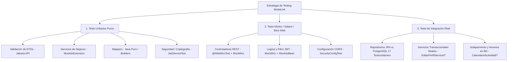

# Informe Integral de Testing — ModaLink Backend

> **Ubicación:** `docs/6_presentaciones/tests.md`  
> **Proyecto:** ModaLink Backend (Spring Boot 4.1.0 / Java 25)  
> **Ámbito:** Análisis exhaustivo de `src/test`, tipología de pruebas, tecnologías, detección de brechas (tests faltantes) y propuestas de mejora.

---

## 1. Introducción y Contexto

En el marco del desarrollo de **ModaLink** y bajo los lineamientos metodológicos del **Proceso Unificado (UP)**, la estrategia de aseguramiento de calidad (QA) y verificación de software adopta un enfoque piramidal y riguroso. Cada módulo funcional del sistema cuenta con pruebas automatizadas orientadas a garantizar:
1. **Doble Capa de Validación**: Comprobación tanto en la capa de transporte/controladores (Bean Validation) y lógica de aplicación/dominio (servicios Java con excepciones semánticas), como en la persistencia relacional (constraints, checks y triggers en PostgreSQL).
2. **Robustez ante Fallos**: Cobertura sistemática de caminos felices (2xx) y caminos de error (4xx / excepciones de negocio) con verificación explícita de no-persistencia mediante `verify(repo, never()).save(...)`.
3. **Aislamiento y Trazabilidad**: Diferenciación precisa entre pruebas puras de lógica en memoria, pruebas de integración web sin servidor completo, y pruebas de integración profunda con base de datos real en contenedores.

---

## 2. Tecnologías y Herramientas del Stack de Testing

El proyecto aprovecha las capacidades de **Java 25** y **Spring Boot 4.1.0**, articulando el siguiente conjunto de dependencias y utilidades:

| Herramienta / Framework | Versión / Ámbito | Rol y Utilidad en ModaLink |
| :--- | :--- | :--- |
| **JUnit 5 (Jupiter)** | `junit-jupiter` 5.x | Motor estándar de ejecución de pruebas (`@Test`, `@BeforeEach`, `@DisplayName`, aserciones JUnit). |
| **Mockito** | 5.x (`mockito-junit-jupiter`) | Aislamiento y dobles de prueba (`@Mock`, `@InjectMocks`, `@MockitoBean`, `ArgumentCaptor`, `verify`). Permite probar la capa de servicio sin acoplamiento a I/O. |
| **Spring Boot Test** | `spring-boot-starter-test` | Soporte de contexto de pruebas de Spring, inyección de dependencias y utilidades de testing. |
| **Spring WebMvc Test & MockMvc** | `spring-boot-starter-webmvc-test` | Pruebas de integración de capa web (`@WebMvcTest`). Permite probar serialización/deserialización JSON, códigos HTTP, validaciones `@Valid` y cabeceras/cookies sin levantar el servidor HTTP subyacente. |
| **Spring Security Test** | `spring-security-test` | Simulación de identidades y contextos de seguridad (`SecurityMockMvcRequestPostProcessors`, autenticaciones simuladas y factorías `@WithSecurityContext`). |
| **Jakarta Bean Validation** | `jakarta.validation` | Instanciación del validador puro (`Validation.buildDefaultValidatorFactory().getValidator()`) para pruebas ultrarrápidas de DTOs sin requerir contexto de Spring. |
| **Testcontainers** | 1.21.3 (`testcontainers-bom`, `postgresql`) | Orquestación de contenedores Docker reales con **PostgreSQL 17 Alpine**, ejecutando migraciones completas de Flyway para validar esquemas, constraints y consultas JPA complejas. |
| **AssertJ** | Fluente (módulo `proyectos`) | Aserciones semánticas encadenadas (`assertThat(...)`) para verificar propiedades complejas de respuestas y modelos. |
| **Jackson ObjectMapper** | 2.x | Serialización de DTOs de request a JSON en pruebas con MockMvc. |
| **JaCoCo** | `jacoco-maven-plugin` | Medición del porcentaje de cobertura de código (líneas, ramas e instrucciones), accesible mediante el reporte `target/site/jacoco/index.html`. |

---

## 3. Tipología de Tests en el Proyecto

El repositorio `src/test` implementa una clasificación limpia y estandarizada en 3 grandes categorías:



### 3.1. Tests Unitarios (Unit Tests)
Prueban componentes aislados en memoria, sin levantar el contenedor de Spring ni tocar la base de datos o el sistema de archivos externo:
- **Validación de DTOs (`*DTOValidationTest`)**:
  - *Mecanismo*: Utilizan directamente la API de Jakarta Validation.
  - *Objetivo*: Evalúan constraints como `@NotNull`, `@NotBlank`, `@Size`, `@Min`, `@Max`, `@Pattern`, validando tanto requests correctos (0 violaciones) como campos individuales erróneos.
  - *Ejemplos*: `AuthDTOValidationTest`, `CrearPerfilDTOValidationTest`, `ConfigJornadaRequestValidationTest`, `DeshabilitarUsuarioRequestValidationTest`.
- **Servicios de Aplicación (`*ServiceTest`)**:
  - *Mecanismo*: Anotados con `@ExtendWith(MockitoExtension.class)`. Las dependencias (repositorios, otros servicios) son simuladas con `@Mock` y la clase evaluada con `@InjectMocks`.
  - *Objetivo*: Verificar reglas de negocio, cómputos, transiciones de estado, lanzamientos de excepciones semánticas (`PerfilDuplicadoException`, `JornadaInvalidaException`, etc.) y verificar mediante `ArgumentCaptor` los datos exactos que se pretendían guardar.
  - *Ejemplos*: `AuthServiceTest`, `CrearPerfilServiceTest`, `CalendarioServiceTest`, `AdminUsuarioServiceTest`, `DatosPersonalesServiceTest`.
- **Mappers (`*MapperTest`)**:
  - *Mecanismo*: Java puro, invocación directa de métodos estáticos o instancias simples sin dependencias externas.
  - *Objetivo*: Asegurar la correcta transformación bidireccional entre Entidades JPA y DTOs de salida (`*Response`), verificando casos con listas vacías, campos nulos y ordenamientos.
  - *Ejemplos*: `UsuarioMapperTest`, `PerfilMapperTest`, `CalendarioMapperTest`, `AdminUsuarioMapperTest`.
- **Seguridad Criptográfica y Storage Local**:
  - *Ejemplos*: `JwtServiceTest` (prueba generación, firmas alteradas, expiración y parseo con secretos HS256) y `LocalStorageServiceTest` (prueba I/O de archivos en directorios temporales `tempDir`).

### 3.2. Tests Mixtos / Slice Tests (Corte de Capa Web)
Prueban la interacción de varias piezas dentro de un corte controlado del framework (Application Context parcial):
- **Controladores Web (`*ControllerTest`)**:
  - *Mecanismo*: Anotados con `@WebMvcTest(controllers = ...)` y `@AutoConfigureMockMvc(addFilters = false)`. Los servicios colaboradores se inyectan como `@MockitoBean`.
  - *Naturaleza Mixta*: Combina el enrutamiento HTTP de Spring MVC, serialización Jackson, validación automática con `@Valid` y el manejador global de excepciones (`GlobalExceptionHandler`), mientras la lógica de negocio profunda queda mockeada.
  - *Objetivo*: Asegurar que ante peticiones HTTP válidas se retorne el status correspondiente (`200 OK`, `201 Created`), se produzca el JSON esperado mediante `jsonPath(...)`, y ante violaciones o excepciones se retornen códigos semánticos (`400 Bad Request`, `401 Unauthorized`, `403 Forbidden`, `404 Not Found`, `409 Conflict`).
  - *Ejemplos*: `AuthControllerTest`, `PerfilControllerTest`, `CalendarioControllerTest`, `AdminUsuarioControllerTest`, `ProyectoControllerTest`.
- **Filtros y Flujos de Sesión**:
  - *Ejemplo*: `LogoutIntegrationTest` y `JwtAuthenticationFilterTest`, que simulan la cadena de servlets, cookies `httpOnly`, inyección de cabeceras y propagación en el `SecurityContextHolder`.

### 3.3. Tests de Integración (Integration Tests)
Prueban la integración total entre componentes de software y la infraestructura real de almacenamiento persistente:
- **Repositorios y Reglas de Persistencia (`*RepositoryIntegrationTest`)**:
  - *Mecanismo*: Heredan de `AbstractPostgresIntegrationTest`, que levanta un contenedor Docker estático **singleton** con `postgres:17-alpine`. Spring ejecuta todas las migraciones de Flyway.
  - *Objetivo*: Probar la compatibilidad real del dialecto PostgreSQL, constraints compuestas, unicidad case-sensitive (ej. `findByCorreo`), queries JPQL con JOIN FETCH y proyecciones complejas.
  - *Ejemplos*: `UsuarioRepositoryIntegrationTest`, `CalendarioRepositoryIntegrationTest`, `CalendarioActividadIntegrationTest` (verifica cálculo temporal de solapamientos con margen configurado).
- **Servicios Integrados con BD (`EditarPerfilServiceIntegrationTest`)**:
  - *Mecanismo*: Anotado con `@SpringBootTest` y `@Transactional`.
  - *Objetivo*: Comprobar flujos end-to-end de modificación de entidades complejas con colecciones dependientes (claves compuestas de características técnicas de perfiles) sobre la base de datos real, validando la gestión de dirty-checking y cascadas JPA.

---

## 4. Estructura y Distribución Actual de Tests en el Proyecto

El directorio `src/test` cuenta actualmente con **75 clases de pruebas** (más 1 clase base abstracta de infraestructura):

```
src/test/java/org/mgroko/backend/
├── admin/
│   ├── controlador/
│   │   ├── AdminCaracteristicaTecnicaControllerTest.java
│   │   ├── AdminConfiguracionControllerTest.java
│   │   ├── AdminUsuarioControllerTest.java
│   │   └── AdminUsuarioPerfilControllerTest.java
│   ├── dto/
│   │   ├── AdminCaracteristicaTecnicaRequestValidationTest.java
│   │   ├── AdminValorCaracteristicaRequestValidationTest.java
│   │   ├── ConfigurarSchedulerRequestValidationTest.java
│   │   └── DeshabilitarUsuarioRequestValidationTest.java
│   ├── mapper/AdminUsuarioMapperTest.java
│   └── servicio/
│       ├── AdminCaracteristicaTecnicaServiceTest.java
│       ├── AdminUsuarioServiceTest.java
│       ├── ConfiguracionSistemaServiceTest.java
│       ├── DeshabilitacionSchedulerTest.java
│       └── ExpirarDeshabilitacionServiceTest.java
├── auth/
│   ├── AuthControllerTest.java
│   ├── AuthServiceTest.java
│   ├── LogoutIntegrationTest.java
│   ├── UsuarioMapperTest.java
│   └── dto/AuthDTOValidationTest.java
├── calendario/
│   ├── controlador/CalendarioControllerTest.java
│   ├── dto/ConfigJornadaRequestValidationTest.java
│   ├── dto/MarcarNoDisponibleRequestValidationTest.java
│   ├── mapper/CalendarioMapperTest.java
│   └── servicio/CalendarioServiceTest.java
├── home/
│   └── controlador/HomeControllerTest.java
├── perfiles/
│   ├── controlador/
│   │   ├── CaracteristicaTecnicaControllerTest.java
│   │   ├── PerfilControllerTest.java
│   │   └── ProfesionControllerTest.java
│   ├── dto/
│   │   ├── CrearPerfilDTOValidationTest.java
│   │   └── EditarPerfilDTOValidationTest.java
│   ├── mapper/
│   │   ├── CaracteristicaTecnicaMapperTest.java
│   │   ├── PerfilMapperTest.java
│   │   └── ProfesionMapperTest.java
│   └── servicio/
│       ├── ActivarPerfilServiceTest.java
│       ├── BuscarPerfilServiceTest.java
│       ├── CaracteristicaPerfilHelperTest.java
│       ├── CaracteristicaTecnicaServiceTest.java
│       ├── CrearPerfilServiceTest.java
│       ├── EditarPerfilServiceTest.java
│       ├── EliminarPerfilServiceTest.java
│       ├── ExpirarPerfilServiceTest.java
│       ├── FotoPerfilServiceTest.java
│       ├── ProfesionServiceTest.java
│       ├── ReactivarPerfilServiceTest.java
│       ├── UsuarioPerfilServiceTest.java
│       └── VerPerfilServiceTest.java
├── proyectos/
│   ├── controlador/ProyectoControllerTest.java
│   ├── dto/CrearProyectoDTOValidationTest.java
│   └── servicio/
│       ├── CrearProyectoServiceTest.java
│       └── ProyectoSecurityServiceTest.java
├── repositorio/
│   ├── AbstractPostgresIntegrationTest.java (Clase Base Contenedor Singleton)
│   ├── CalendarioActividadIntegrationTest.java
│   ├── CalendarioRepositoryIntegrationTest.java
│   ├── CaracteristicaTecnicaRepositoryIntegrationTest.java
│   ├── EditarPerfilServiceIntegrationTest.java
│   ├── GeneroRepositoryIntegrationTest.java
│   ├── ProfesionRepositoryIntegrationTest.java
│   ├── RolGlobalRepositoryIntegrationTest.java
│   ├── UbicacionRepositoryIntegrationTest.java
│   └── UsuarioRepositoryIntegrationTest.java
├── security/
│   ├── JwtAuthenticationFilterTest.java
│   ├── JwtServiceTest.java
│   └── SecurityConfigTest.java
├── storage/
│   └── servicio/LocalStorageServiceTest.java
├── ubicacion/
│   ├── controlador/
│   │   ├── UbicacionCatalogoControllerTest.java
│   │   └── UbicacionUsuarioControllerTest.java
│   ├── dto/UbicacionRequestValidationTest.java
│   ├── mapper/UbicacionMapperTest.java
│   └── servicio/
│       ├── GeorefCatalogoServiceTest.java
│       ├── UbicacionServiceTest.java
│       └── UbicacionUsuarioServiceTest.java
└── usuario/
    ├── controlador/DatosPersonalesControllerTest.java
    ├── dto/DatosPersonalesDTOValidationTest.java
    ├── mapper/DatosPersonalesMapperTest.java
    └── servicio/
        ├── DatosPersonalesServiceTest.java
        └── ExpirarCuentaServiceTest.java
```

---

## 5. Análisis de Brechas: Tests Faltantes

Tras contrastar los controladores, servicios, DTOs y repositorios presentes en `src/main/java` contra los existentes en `src/test/java`, se han detectado las siguientes áreas desprotegidas o incompletas:

### 5.1. Módulo `admin`
> **Estado:** :white_check_mark: **Completado.** Todos los componentes pendientes fueron implementados y verificados con éxito (94 tests unitarios y de controlador pasando en el módulo).
- **Controladores testeados**:
  - `AdminUsuarioControllerTest`: Habilitación y deshabilitación con motivos y duraciones.
  - `AdminCaracteristicaTecnicaControllerTest`: CRUD completo de características técnicas y administración de valores asociados (`POST`, `PUT`, `DELETE`, `GET`), con mapeo a 200, 201, 204, 400, 404 y 409.
  - `AdminConfiguracionControllerTest`: Obtención, actualización de horarios de scheduler y ejecución manual (`/ejecutar-ahora`).
  - `AdminUsuarioPerfilControllerTest`: Listado de perfiles asociados a un usuario específico.
- **Servicios testeados**:
  - `AdminUsuarioServiceTest`: Reglas de auto-deshabilitación, duraciones y cambio de estados.
  - `AdminCaracteristicaTecnicaServiceTest`: Validación de tipos (`ENUMERADO`, `TEXTO`, `NUMERICO`), unicidad de códigos, prevención de borrado o cambio de tipo si está en uso por perfiles.
  - `ConfiguracionSistemaServiceTest`: Actualización de cron y ejecución.
  - `ExpirarDeshabilitacionServiceTest`: Reactivación por vencimiento.
  - `DeshabilitacionSchedulerTest`: Registro de tarea `TriggerTask` y disparo de la reactivación automática.
- **Validación de DTOs**:
  - `DeshabilitarUsuarioRequestValidationTest`: Motivo obligatorio y duración positiva.
  - `AdminCaracteristicaTecnicaRequestValidationTest`: Código no blanco, longitud máxima, tipo de dato y validación en cascada de valores.
  - `AdminValorCaracteristicaRequestValidationTest`: Código requerido y formato regex `#RRGGBB` para color hexadecimal.
  - `ConfigurarSchedulerRequestValidationTest`: Rangos de hora (0-23) y minuto (0-59).
- **Mappers**:
  - `AdminUsuarioMapperTest`: Transformación entidad `Usuario` a `AdminUsuarioResponse`.

### 5.2. Módulo `usuario`
1. **Controladores sin test**:
   - `SolicitudBajaController`: Endpoint `POST /usuario/solicitar-baja`.
   - `ReactivarCuentaController`: Endpoint `POST /usuario/reactivar-cuenta`.
2. **Servicios sin test unitario**:
   - `SolicitudBajaService`: Lógica de pasaje a `PendienteBaja` de usuario y perfiles asociados, cálculo de fecha límite (30 días) y excepciones cuando la cuenta ya está en baja o pendiente.
   - `ReactivarCuentaService`: Reactivación de cuenta y perfiles asociados dentro del plazo de 30 días, y rechazo si el plazo ha expirado.
   - `BajaCuentaScheduler`: Tarea programada de ejecución de expiración.

### 5.3. Módulo `proyectos`
1. **Pruebas de Integración con BD (`repositorio`)**:
   - Falta un `ProyectoRepositoryIntegrationTest` que pruebe en PostgreSQL real la query nativa/JPQL `existeProyectoConNombreParaPerfil` (verificando case-insensitivity con `LOWER(...)` y el join con `MiembroProyecto`).
   - Falta validar en base de datos las restricciones de clave foránea y relaciones de `MiembroProyectoRepository`, `PlanificacionRepository` y `ObjetivoRepository`.
2. **Mappers**:
   - No existe test unitario para `ProyectoMapper` (`toResponse`, mapeo de miembros, objetivos y planificación).

### 5.4. Módulo `perfiles` y `storage`
1. **Controlador y Storage**:
   - `LocalStorageService`: Cuenta con test de servicio pero no hay test de integración de descarga/streaming de recursos estáticos si se expusieran públicamente.
2. **Perfiles - Repositorio**:
   - Falta un `PerfilRepositoryIntegrationTest` dedicado que verifique las consultas derivadas complejas (`existsByUsuarioIdUsuarioAndProfesionIdProfesionAndEstadoNot`, `findByEstadoAndFechaSolicitudBajaBefore`, etc.).

---

## 6. Posibles Mejoras del Ecosistema de Testing

Para elevar el estándar del proyecto a un nivel industrial de cara a la defensa y escalabilidad a largo plazo, se sugieren las siguientes mejoras:

### 6.1. Ejecución Condicional y Perfiles de Maven
- **Separación de Unit e Integration Tests**: Actualmente todos los tests corren con `mvn test`. Si un desarrollador o entorno CI/CD no tiene Docker encendido, los tests de `repositorio/*` fallan.
- *Propuesta*: Configurar `maven-failsafe-plugin` para tests de integración (`*IT.java`) bajo el comando `mvn verify`, reservando `maven-surefire-plugin` (`mvn test`) para los unitarios y slice tests que corren en milisegundos sin Docker.

### 6.2. Uso de `@Nested` y Pruebas Parametrizadas en DTOs
- **Pruebas Parametrizadas (`@ParameterizedTest` + `@ValueSource` / `@NullAndEmptySource`)**: Gran parte de los tests de validación de DTO repiten lógica para probar cadenas vacías, strings con espacios y nulls. El uso de tests parametrizados reduce el código de prueba en un 60% y mejora la legibilidad.
- **Estructuración jerárquica con `@Nested`**: Agrupar escenarios en los controladores y servicios por caso de uso (`@Nested class CuandoElPerfilEstaActivo`, `@Nested class CuandoElPerfilEstaEnBaja`).

### 6.3. Cobertura de Seguridad y Autorización en Capa Web
- En los tests de controladores se utiliza `@AutoConfigureMockMvc(addFilters = false)` para testear la lógica de enrutamiento y serialización.
- *Propuesta*: Incorporar una suite de pruebas con la seguridad activada (`addFilters = true`) utilizando `@WithMockUser(authorities = {...})` para certificar que anotaciones de seguridad como `@PreAuthorize("hasAuthority('VER_USUARIOS')")` o los roles `ADMINISTRADOR` / `USUARIO` realmente bloquean con `403 Forbidden` a usuarios no autorizados a nivel de filtro HTTP.

### 6.4. Generadores y Object Mothers / Fixtures
- Centralizar la construcción de entidades complejas (`Usuario`, `Perfil`, `Proyecto`) en clases auxiliares de tipo **Object Mother** o **Builders Compartidos** en `src/test/java/.../fixture/`, evitando duplicación de métodos privados (`usuarioActivo()`, `perfilValido()`) dispersos entre los distintos paquetes de prueba.

### 6.5. Verificación de Integración Continua (CI/CD)
- Implementar un workflow de GitHub Actions que ejecute el pipeline completo (`mvn clean verify`), levante el daemon de Docker para Testcontainers y publique automáticamente el badge de cobertura generado por JaCoCo en el `README.md`.
